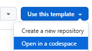
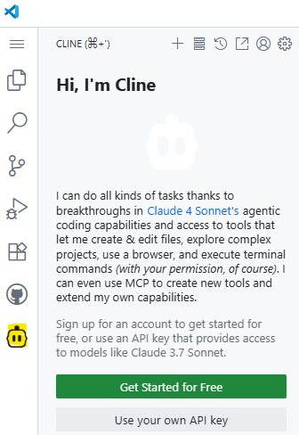
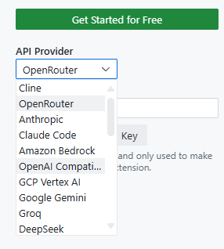
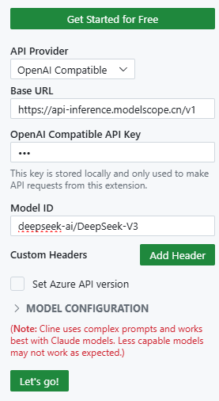
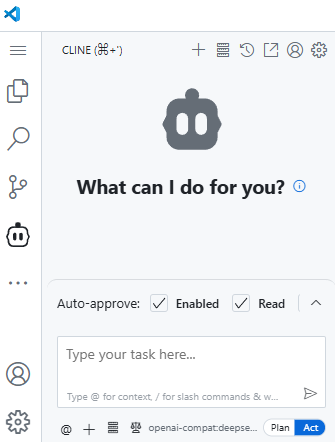

# Flutter Web Development Codespace

This GitHub Codespace is configured for Flutter web application development. It includes:

- **Flutter SDK**: The latest stable version of Flutter is pre-installed.
- **VS Code Extensions**: Essential extensions for Flutter/Dart development, Prettier, and Cline are pre-installed.
- **Common Utilities**: Basic development utilities are available.

## Getting Started

1.  **Launch Codespace**: Open this repository in a GitHub Codespace by clicking the "Code" button and selecting "Create codespace on main".

    

2.  **Create/Open Flutter Project**: Once the Codespace is ready, you can create a new Flutter project or open an existing one.
    ```bash
    flutter create --platforms web my_web_app
    cd my_web_app
    ```

## Running Flutter Web App

To run your Flutter web application on port 8080, you must explicitly specify the web device, port, and hostname. Use the following command:

```bash
flutter run -d web-server --web-port 8080 --web-hostname 0.0.0.0
```

The application will be accessible on port 8080 (forwarded automatically).

## Customization

-   **Flutter Version**: To change the Flutter version, modify the `FLUTTER_VERSION` argument in `.devcontainer/Dockerfile`.
-   **VS Code Extensions**: Add or remove extensions in the `customizations.vscode.extensions` section of `.devcontainer/devcontainer.json`.

## Cline Configuration (OpenAI Compatible)

To configure Cline with an OpenAI compatible API, you will need to do so through the VS Code UI after the Codespace has launched. 

||||
|---|---|---|
|1.|  **Launch Codespace**: Open this repository in a GitHub Codespace. |
|2.|  **Click the Cline extension**: The Cline extension icon takes minutes to show. Click on it after it is available||
|3.|  **Click Use your own API key**:||
|4.|  **Configure API Key and Model**: Use the provided fields to enter your API key and select your desired model. The base URL for the OpenAI compatible API is `https://api-inference.modelscope.cn/v1/`.||
|5.|  **Start the AI agentic jounery**||

### Recommended Cline Models

**For Coding:**
- `Qwen/Qwen3-Coder-480B-A35B-Instruct` (Context Length: 262,144 tokens)
- `Qwen/Qwen3-Coder-30B-A3B-Instruct` (Context Length: 262,144 tokens)
- `Qwen/Qwen3-235B-A22B-Instruct-2507` (Context Length: 262,144 tokens)
- `deepseek-ai/DeepSeek-V3` (Context Length: 128,000 tokens)

**For Planning:**
- `Qwen/Qwen3-235B-A22B-Thinking-2507` (Context Length: 262,144 tokens)

## Using this Repository as a Template

This repository is configured as a GitHub Template, allowing other users to easily create their own repositories with this Codespace setup.

To use this template and set up your own Codespace prebuilds:

1.  **Create a New Repository from this Template**:
    - Go to this repository on GitHub.
    - Click the green "Use this template" button to create a new repository in your own GitHub account.

2.  **Enable Codespaces for Your New Repository**:
    - In your newly created repository, navigate to `Settings` > `Codespaces`.
    - Enable Codespaces for that repository.

3.  **Configure Prebuilds for Your New Repository**:
    - Still in `Settings` > `Codespaces` for your new repository, you can now configure prebuilds.
    - Since this template includes the `.devcontainer` folder with the `Dockerfile` and `devcontainer.json`, all the necessary instructions for building the environment (Flutter, extensions, etc.) are already provided.
    - Enable prebuilds for your desired branches (e.g., `main`) and set the update frequency. This will build and store prebuilt images in your own account, significantly speeding up subsequent Codespace creations.

## Billing

GitHub Codespaces offers a generous free tier for individual users. For personal GitHub Free accounts, the monthly free usage includes:

-   **120 core hours** (or 60 hours of runtime on a 2-core codespace, 30 hours on a 4-core codespace, etc.).
-   **15 GB of storage** (includes space for your codespace and prebuilt images).

**Core Hours Explanation:**
Core hours are calculated based on the number of CPU cores your codespace uses. For example:
- A 2-core codespace running for 1 hour = 2 core hours
- A 4-core codespace running for 1 hour = 4 core hours

**Storage Details:**
The 15 GB storage limit includes:
- Your codespace's file system
- Prebuilt images
- Cached dependencies

If you exceed these limits, you will be charged on a pay-as-you-go basis:
- **Core hours**: $0.18 per core hour
- **Storage**: $0.07 per GB-month

You can set a spending limit in your GitHub account settings to avoid unexpected charges. For GitHub Pro, Team, or Enterprise accounts, different pricing and limits may apply.
